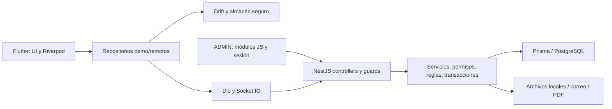

# Auditoría de relevo SaberPlus — 2026-09-28

> Resultado posterior, estabilización del 29 de septiembre: S1 (Tira) y S2
> (contraseña inicial) tienen correcciones **locales**, sin despliegue, descritas
> en [ESTABILIZACION_PRE_PR_I1_2026-09-29.md](ESTABILIZACION_PRE_PR_I1_2026-09-29.md).
> Se preserva abajo la auditoría aceptada y sus hallazgos/contadores históricos.

Informe solicitado el 28 de septiembre; cierre documental local el 29 de septiembre de 2026. No se alteran las fechas de pruebas históricas. Alcance: Flutter, NestJS/Prisma y ADMIN, con revisión estática, instalaciones y pruebas locales. No es una certificación de producción ni un pentest exhaustivo.

**Resultado:** lockfile backend reparado con 25 líneas añadidas; instalación, build y Jest pasan. Flutter analyze/tests y ADMIN pasan. Lint backend y auditoría de dependencias tienen hallazgos. APK queda limitado por TLS Java; PostgreSQL local por binarios ausentes. Hay dos P1 funcionales/de seguridad reproducidos con dobles y un P1 de dependencias. No se implementó PR-I1. Las decisiones pendientes están en la matriz enlazada abajo.

## 1. Repositorios, alcance y evidencia

| Repositorio | Rama local | HEAD auditado |
|---|---|---|
| C:\Users\luisk\Desktop\saber_plus | docs/auditoria-relevo-2026-09-28 | cf6e59d92142946416e4658ca9f9bed2b1704837 |
| C:\Users\luisk\Desktop\SaberPlus-Backend | fix/backend-lockfile-ci | 52abde26a5f4f4e5b87e567ee8fdc69edca9abe4 |

Ambos partían de main. Se comprobó origin/main con `git ls-remote` durante la inspección: coincidía con esos HEAD. En Flutter cf6e59d es documentación posterior al cambio funcional f6221c4. No se hicieron commits, push, merge, despliegues ni migraciones remotas. Los cambios locales de esta auditoría no están publicados. No se inspeccionaron estados de ejecuciones remotas de GitHub Actions, Render o Supabase.

Cobertura estructural: **1116 archivos versionados**, **263 declaraciones HTTP**, **59 modelos**, **33 enums**, **50 migraciones** y **117 documentos Markdown**. Se leyeron los archivos textuales para extracción/inventario y se revisaron semánticamente los recorridos críticos aquí identificados; eso no equivale a revisar manualmente cada línea ni a probar cada endpoint. Binarios inventariados, no interpretados como código. Los artefactos nuevos quedan fuera del inventario de archivos versionados.

| Anexo | Contenido y límite |
|---|---|
| [Matriz A](auditoria-relevo-2026-09-28/funcionalidades.md) | Funcionalidades, capas, persistencia, pruebas y estados separados |
| [Matriz B](auditoria-relevo-2026-09-28/endpoints.md) y [JSON](auditoria-relevo-2026-09-28/endpoints.json) | Cada declaración HTTP: guard, DTO, devolución/delegación, servicio, acceso Prisma directo y posibles consumidores/tests |
| [Matriz C, esquema y SQL](auditoria-relevo-2026-09-28/datos.md) | Todas las definiciones actuales y las 50 migraciones completas; interpretación por dominio en §7 |
| [Juegos y decisiones](auditoria-relevo-2026-09-28/juegos-y-decisiones.md) | Matriz competitiva de 8 juegos, trazas y reglas CONFIRMADO/PROPUESTO/NECESITA DECISIÓN |
| [Inventario](auditoria-relevo-2026-09-28/inventario.md) y [JSON](auditoria-relevo-2026-09-28/inventario.json) | Rutas, clasificación, símbolos, tamaño, líneas y SHA-256 del snapshot de trabajo |
| [Catálogo documental](auditoria-relevo-2026-09-28/documentacion.md) | Clasificación orientativa; JSON conserva encabezados para navegación |
| [Marcadores de deuda](auditoria-relevo-2026-09-28/marcadores-deuda.json) | 904 líneas con etiquetas; no son 904 defectos |
| [Reproducciones locales](auditoria-relevo-2026-09-28/repro-seguridad.cjs) | Privacidad Tira, guard de contraseña inicial y ranking100, con Prisma/firma simulados |
| [Evidencia de ejecución](auditoria-relevo-2026-09-28/verificaciones.md) | Comandos, resultados y lock diff |
| [Lista exacta de cambios](auditoria-relevo-2026-09-28/cambios.md) | Archivos modificados/nuevos por repositorio; cambios ajenos separados |

El generador `generar-inventario.cjs` usa TypeScript instalado en el backend. Ejecutarlo desde Flutter pasando la raíz backend vuelve a generar un snapshot; los SHA no son los de HEAD cuando el archivo ya tenía cambios locales. Los documentos posteriores a ese snapshot pueden tener otros hashes por la conciliación documental.

## 2. Entorno y límites

Windows/PowerShell; Flutter 3.44.9 stable, revisión 6b182d2c75; Dart 3.12.2. Flutter está en `C:\Users\luisk\Documents\MOVIL\flutter`. Backend validado con **Node 24.14.1 y npm 11.11.0**, obtenidos en caché temporal sin sustituir instalaciones globales. El npm local previo era 11.9.0 sobre Node24.14.0; ADMIN y primera línea base se ejecutaron con esa instalación. No se necesita actualizar versiones productivas para reparar el lock.

Flutter baseline se ejecutó en copia limpia de HEAD dentro del directorio temporal `saberplus-audit-688cf1882a524c97818fd34bccc4808b/flutter`. Backend fallido inicial en `server-head`; reparación y verificaciones en el repositorio de trabajo. Para generación Prisma/build se usaron URLs ficticias loopback puerto65431; no se conectó a una base externa.

**LIMITACIÓN DEL ENTORNO DE AUDITORÍA — APK:** Gradle9.1.0 no pudo resolver artefactos por `PKIX path building failed` / `certificate_unknown` contra repositorios Google/Maven/Flutter. JBR de Android Studio 25.0.2, build 25.0.2+-15348964-b329.117; cacerts existente de132316 bytes. No se encontró evidencia que justifique cambiar repositorios, wrapper o código Android para este error. No se desactivó TLS ni se cambió el truststore. Advertencia de KGP en flutter_timezone no es la causa demostrada. No se comprobó build APK verde en otro entorno/CI. iOS requiere macOS/Xcode y no se ejecutó.

**PostgreSQL:** runner seguro aplicable, pero `initdb.exe` no está disponible donde lo busca ni en PATH. Falló ENOENT antes de crear DB. No equivale a fallo SQL. No se instalaron servidores ni se usó Docker/Supabase para rodear esta limitación. Las pruebas unitarias no acreditan RLS, bloqueo o migraciones ejecutados sobre PostgreSQL real.

Para npm fue necesario usar `NODE_USE_SYSTEM_CA=1` por la cadena de confianza del entorno; se conserva validación TLS. No se cambió `.npmrc` ni se usó strict-ssl=false.

## 3. Lockfiles y cambios ajenos

### Flutter: cambio preexistente preservado

| Dependencia | HEAD | Archivo local reproducido con SDK actual |
|---|---|---|
| clock | 1.1.3 | 1.1.2 |
| intl | 0.20.3 | 0.20.2 |
| matcher | 0.12.20 | 0.12.19 |
| meta | 1.19.0 | 1.18.0 |
| stack_trace | 1.12.2 | 1.12.1 |
| test_api | 0.7.12 | 0.7.11 |
| vector_math | 2.4.2 | 2.2.0 |

Cambian versión y SHA de cada paquete (14 líneas añadidas/14 eliminadas); no fuente hosted/pub.dev ni otros paquetes. No son solo metadatos. flutter_test fija clock/matcher/meta/stack_trace/test_api/vector_math; flutter fija meta/vector_math y flutter_localizations fija intl. Los pubspec del SDK instalado explican exactamente la resolución. En copia limpia `flutter pub get` reprodujo el SHA-256 local **2CB0D83AEB4D55AED93870E5F3F4930B78C225317A5EF35E2A13C16D4D2714A4**.

El lock de HEAD no concuerda con los pins de este SDK. Otra resolución/SDK anterior es una hipótesis, no origen probado: `.metadata` ya declara la misma revisión Flutter. Recomendación: conservar el cambio ajeno; acordar y fijar SDK/lock juntos en una entrega independiente para reproducibilidad. No sobrescribirlo ni incorporarlo silenciosamente a esta auditoría.

Al retomar apareció además un cambio ajeno en `pubspec.yaml`: comillas de publish_to y una línea en blanco. Se preservó; no lo produjo esta auditoría.

### Backend: corrección mínima demostrada

`npm ci` exigía @emnapi/core@1.11.3 y @emnapi/runtime@1.11.3, ausentes en ubicaciones raíz del lock. @napi-rs/wasm-runtime1.1.5 necesita esos pares; las versiones1.10.0 anidadas bajo el binding WASM del resolver no satisfacen esa ubicación.

Primero se ejecutó `npm install --package-lock-only` con versiones exactas solicitadas. npm añadió las entradas pero también recalculó flags peer de paquetes existentes. Se descartó únicamente ese ruido generado por la operación propia, conservando las dos entradas generadas por npm. Resultado: **backend/package-lock.json: 25 insertions(+), sin eliminaciones**. No cambian package.json, versiones ni integridades existentes. @emnapi/core/runtime1.11.3 son dev/optional/peer; core referencia wasi-threads1.2.3 ya presente y ambos tslib^2.4.0. Diff completo en verificaciones.md. El `npm ci --include=dev --prefix backend` posterior pasó con825 paquetes añadidos/826 auditados.

## 4. Arquitectura real

Flutter separa app/router/sesión, core (red, almacenamiento, DB, sincronización, notificaciones, anuncios, seguridad, widgets) y features. Riverpod selecciona implementación demo/remota; errores remotos en recorridos muestreados no se convierten silenciosamente en resultados demo. GoRouter aplica navegación por sesión/rol. Dio limita origen y redirecciones; generación de sesión evita aplicar respuestas tardías a otra cuenta. Eso no sustituye permisos del backend.

Drift esquema10: OfflineDownloads, PendingOperations, FavoriteEntries, LearningResumeEntries, FlashcardProgressEntries, DifficultQuestionEntries, StudyTimeEntries, PomodoroSyncEntries y DeferredReviewEntries. Particionado por cuenta; colas con revisiones/estados e identificadores de operación. La cola general sincroniza progreso y cuaderno; Pomodoro y repaso tienen mecanismos específicos. No hay cola para conceder XP de partidas offline arbitrarias.

NestJS AppModule integra auth, simulacro, admin, institución/calendario, ventas/cupones/referidos/soporte, diagnóstico/plan/tutorial/anuncios, ranking/gamificación, batallas/cuaderno/tira/trivia/guardián/cima/rescate/mapa/repaso. Pagos heredados y Escudo responden retirada; conservar tablas antiguas no reabre la funcionalidad. Prisma5.22 conecta PostgreSQL; las migraciones agregan también CHECK, índices parciales y RLS que no se expresan enteramente en schema.prisma.

ADMIN es aplicación de módulos JS sin dependencias npm externas de runtime en su paquete. Sesión, cliente API, editor de bloques, publicación directa, cobertura, mapa y herramientas de legado. Sus88 pruebas usan Node/dobles DOM; no acreditan disposición visual ni conexión real. No se rediseñó el panel.

## 5. HTTP, contratos y consumidores

La matriz B contiene las263 declaraciones, incluyendo controllers en archivos module.ts. Guards de clase/método y el decorador `RetiredEditorialWrite` se identifican; este último añade rechazo410. Rutas declaradas no implican que el despliegue remoto las monte. La respuesta de muchos métodos es inferida por TypeScript: se conserva expresión de retorno, servicio/símbolo/línea; no se inventa un DTO nominal inexistente. Los accesos Prisma listados son directos, no un grafo completo de auxiliares.

Contrastes manuales principales: auth/perfil; study/practice/simulacro; ranking; instituciones/evidencia; ocho juegos; mapa; repaso; /admin/simple/editorial. No se detectó incompatibilidad estructural general en esas trazas con los tests locales; quedan contratos dinámicos/E2E sin ejecutar. `ranking.limite`100 contradice top50, el contrato de Tira expone identidad privada y la restricción de contraseña queda solo en clientes.

Endpoints sin consumidor móvil pueden ser salud, administración, ventas/públicos o rutas retiradas. `pagos`/`knowledge-shield` y escrituras editoriales legacy410 se preservan para rechazo explícito, no para integrarlos otra vez. La importación de paquetes expone preview; no hay que suponer que preview guarda el paquete. Nuevos perfiles públicos/@usuario/temporadas/códigos institucionales PR-I no tienen endpoints implementados que conectar. No se halló endpoint para conceder insignias anuales.

Los consumidores candidatos del anexo usan coincidencia de prefijo. «Sin coincidencia» no demuestra orfandad y una coincidencia no confirma llamada. Se evita presentar ese análisis estático como exhaustivo de rutas construidas dinámicamente. Las pruebas por nombre tampoco demuestran cobertura individual de cada endpoint. Para cerrar incompatibilidades desplegadas faltan pruebas de contrato con API/DB autorizadas.

## 6. Socket.IO

Namespace `/tira-afloja`, transporte websocket, CORS configurado, maxHttpBufferSize100000, recuperación hasta120s. Handshake valida JWT, usuario ESTUDIANTE y correo; el servicio restringe acceso a participantes. Identidad cacheada en socket: no reconsulta expiración/rol en cada mensaje. Límite30 acciones/10s por socket; abrir varias conexiones no comparte contador de cuenta.

| Evento | Emisor | Receptor | Payload | Autorización | Persistencia | Juego/función |
|---|---|---|---|---|---|---|
| tira:emparejar | Flutter | gateway | EmparejarWsDto: área | Sesión handshake + validarEstudiante | Partida/preguntas | Tira online |
| tira:sincronizar | Flutter | gateway | partidaId, desdeVersion opcional | Pertenencia antes de unir sala | Lectura estado/eventos | Reconexión |
| tira:listo | Flutter | gateway | partidaId | Participante y estado válido | Estado/eventos | Inicio |
| tira:responder | Flutter | gateway | partidaId y ResponderWsDto (respuesta/operación) | Participante, pregunta/ronda/tiempo | Respuesta y evento transaccionales | Cálculo de cuerda |
| tira:abandonar | Flutter | gateway | partidaId | Participante | Resultado/eventos | Cierre |
| tira:latido | Flutter | gateway | Sin datos de partida; ack servidorAhora | Socket autenticado, límite | Ninguna | Reloj |
| tira:conectado | gateway | cliente | servidorAhora, partidaId, version, recuperada | Socket autenticado | Ninguna | Inicialización |
| tira:estado | gateway | cliente solicitante | Estado presentado de partida | Servicio verifica pertenencia | Derivado de DB | Estado; incluye P1 identidad rival |
| tira:actualizada | publicador/gateway | sala de partida | partidaId, servidorAhora | Sala unida tras acceso autorizado | Cambio previo persistido | Aviso de resincronización |
| tira:presencia | gateway | sala | usuarioId, conectado, servidorAhora | Sala de participantes | Efímero | Presencia; expone UUID interno |
| tira:error | gateway | cliente | Error normalizado | Fallo conexión/operación | Ninguna | Manejo de error |

Fuente: tira-afloja.gateway.ts y tug_realtime_client.dart. Los acknowledgements de acciones incluyen ok/version. El worker de expiración y publicador notifican cambios; no se probó recuperación entre dos procesos/dispositivos ni escalado distribuido.

## 7. Datos, migraciones y concurrencia

Se inventarió todo el SQL versionado en orden, incluyendo migraciones históricas de funcionalidades retiradas. No se alteraron migraciones existentes. `prisma/supabase/prepare.sql` prepara compatibilidad de uuid_generate_v4/search_path; no es prueba de ejecución en Supabase. Extensión uuid-ossp y su esquema son dependencia de instalación a validar en PostgreSQL limpio.

| Dominio | Modelos/datos | Restricciones, índices, relaciones y riesgos |
|---|---|---|
| Usuarios/roles | Usuario; RolUsuario ESTUDIANTE/PROFESOR/ADMIN | Correo único; flags/tokens y relación institución. Rol leído desde DB por guards. Sin tabla de sesiones/tokenVersion ni @usuario público. No publicar nombre privado automáticamente |
| Instituciones/profesores | Institucion, SolicitudAltaInstitucion, MiembroInstitucion, SolicitudIngresoInstitucion, InvitacionInstitucion, AuditoriaInstitucion | Membresía usuario única y par institución/usuario; índices por rol/estado/fechas. Profesor autorizado por membresía/grupo, no solo rol global. Auditoría institucional existe; no equivale a auditoría completa de toda operación |
| Grupos | Clase, ClaseEstudiante, ClaseProfesor, CodigoTemporalGrupo, PrioridadDocente | Relaciones/únicos de asociación, índices por código y fechas; cupos y permisos se validan en servicios. Código grupo distinto al código institucional propuesto. Ensayo concurrente con DB pendiente |
| XP/ranking | Usuario.xpTotal, ResultadoSimulacro, BatallaParticipante, BatallaEstadistica | No modelo de temporada, aporte competitivo o concesión insignia. xpTotal acumulado; ranking derivado en memoria. ResultadoSimulacro sin índice compuesto usuario/fecha explícito en schema; medir consultas antes de optimizar |
| Batallas | Batalla, Pregunta, Participante, Respuesta, Estadistica, Bloqueo, Reporte | Únicos batalla/orden y batalla/usuario/pregunta; índices usuario/finalización. CAS xpLiquidadoEn dentro de transacción; cupo transversal requiere prueba. Bloqueo único pareja; reporte único batalla/reportante |
| Tira | PartidaTiraAfloja, TiraAflojaPregunta/Respuesta/Evento | Único partida/ronda/usuario; clave de operación; único partida/versión evento. Índices por jugador/estado/fecha y cascadas de hijos; estado/versiones servidor. Presencia no persistida |
| Trivia/Fantasma | IntentoTriviaRush, TriviaRushPregunta/Respuesta/Potenciador, ConcesionRecompensaJuego | Únicos orden/operación/concesión y respuestas por pregunta/número; índices estado/vencimiento/usuario. Versiones, asistido y concesión consumida controlan ayudas. Sin campo de juego Fantasma independiente |
| Cima/Guardián/Rescate | IntentoCima, IntentoGuardian, IntentoRescateEstrellas | Snapshots y recibos en JSON; validación app importa tanto como columnas. SQL añade CHECK y únicos parciales de intentos activos donde corresponde; bloqueos transaccionales. Versionado no debe presumirse uniforme entre juegos |
| Escudo | IntentoEscudoConocimiento | Tabla histórica conservada; rutas retiradas410. No borrar historial como parte de auditoría |
| Diagnóstico/plan | DiagnosticoInicial, DiagnosticoResultadoArea, PlanEstudioSemanal/Actividad | Área única por diagnóstico; plan usuario/semana y actividad plan/fecha únicos. Índices por diagnóstico/área/nivel; conserva contexto académico |
| Simulacros/respuestas | IntentoSimulacro, ResultadoSimulacro, HistorialRespuesta | Intento ligado a usuario/origen/preguntas/expiración; updateMany consume una vez en transacción. Historial indexado usuario/fecha/corrección/área, pregunta y sesión. Tiempos de respuesta cliente no sirven por sí solos como evidencia de velocidad |
| Contenido | Tema, Subtema, Pregunta, Respuesta, CasoPregunta | EstadoContenido, revisión, huella; índices estado/área/subtema y caso/orden. Guards/services protegen edición de contenido usado y padres publicados. Cascadas SQL deben leerse con servicios: no asumir borrado masivo permitido. Versiones/restauración editorial completa siguen C6 |
| Progreso/cuaderno | ProgresoTema, CuadernoError | Único usuario/subtema y usuario/pregunta; cuaderno indexado estado/fecha. Progreso es porcentaje declarado; no convierte lectura en evaluación independiente |
| Mapa MA-2 | MapaAprendizaje, RelacionAprendizaje | Área/revisión y par dirigido previo/destino; CHECK sin autorrelación, índices destino/área. Ciclos/max8 directas/max5000 área se comprueban en servicio con bloqueo por área; eliminación de nodos limpia relaciones. RLS/revoke en migración |
| Repaso/flashcards MA-3 | RepasoDiferido, EventoRepasoDiferido | PK usuario/versión/tarjeta; recibo usuario/evento; hash y respuesta JSON para reintento. TIMESTAMPTZ, CHECK revisión>0/paso0..4/vencimiento posterior. Advisory lock usuario y clock_timestamp servidor. No índice específico usuario/creadoEn para el conteo24h; revisar crecimiento |
| Tiempo/Pomodoro | PomodoroRegistrado | Eventos por usuario con unicidad de finalización; payload UTC e idempotencia. Tiempo declarado no equivale a vigilancia/medición infalible de atención |
| Certificados | Sin modelo de emisión | Se recalculan desde subtemas publicados y ProgresoTema; sin número/archivo de emisión permanente ni snapshot histórico. Son certificados de finalización, no insignias o prueba de dominio |
| Comercial/anuncios | PagoOrden, Referido, Cupon, LeadVentas, Anuncio/Lectura, ConfiguracionSoporte, CalendarioIcfes | Tablas legacy no significan pagos activos; índices por estado/fechas/audiencia. Calendario único año/tipo; lectura por cuenta. Operación real no auditada |

RLS y REVOKE se incorporan en SQL de módulos recientes; no se afirma que todas las tablas legacy tengan la misma política ni que el despliegue esté protegido. Prisma usa una conexión privilegiada: la autorización por recurso en NestJS sigue siendo necesaria aun con RLS. Las restricciones presentes en SQL pero no en Prisma deben preservarse al preparar migraciones futuras; `db push` no sustituye este historial.

## 8. Seguridad y hallazgos

Gravedad es prioridad de corrección, no una afirmación de explotación en producción. **No se confirmó P0** dentro de este alcance. No se hicieron cambios de lógica de seguridad.

| ID | Nivel | Hallazgo/evidencia | Alcance y acción recomendada |
|---|---|---|---|
| S1 | P1 | TiraAflojaService.obtener presenta rival con nombre de Usuario, ID y foto; gateway presencia expone usuarioId | Reproducción con doble confirma que participante ve nombre privado; tercero ajeno es rechazado. Separar identidad pública/privada antes de exposición social; no es IDOR arbitrario confirmado |
| S2 | P1 | JwtGuard/AdminGuard no seleccionan ni exigen debeCambiarContrasena | Cliente puede omitir pantalla y usar token válido. Doble demuestra aceptación; no vulnera firma JWT. Aplicar restricción backend con excepciones mínimas de cambio/salida en entrega autorizada |
| S3 | P1 | npm audit producción: 4 high vinculados a extract-zip/Puppeteer, 3 moderate | Hallazgo real de árbol instalado, no exploit probado. Evaluar actualización aislada y regresión de certificados/correo/uploads; no hacer upgrade mayor automático |
| S4 | P2 | Sin revocación central/tokenVersion/refresh; reset no invalida todos los JWT de8h | Completar política de sesiones. Rol sí se refresca desde DB en HTTP; no decir que un rol viejo JWT conserva ADMIN |
| S5 | P2 | Websocket autentica al conectar; contador por socket; operaciones usan usuario cacheado | Revalidación/revocación y límite por cuenta a diseñar. Ownership del servicio mitiga acceso entre partidas |
| S6 | P2 | Logo-upload valida MIME declarado/extensión/tamaño, sin firma/normalización; disco local | C5 debe normalizar, eliminar metadatos y persistir con permisos. CSP/nosniff mitigan ejecución pero no prueban archivo válido |
| S7 | P2 | Foto perfil admite URL/data y progreso de lectura cliente alimenta certificados | Separar normalización de fotos y significado de finalización; no afirmar que certificado demuestra dominio. Política de rol estudiante no uniforme en repaso/certificados |
| S8 | P2 | SessionController._restoreSession borra sesión ante cualquier excepción de restauración | Fallo transitorio/offline equivale a logout; distinguir red/401 en entrega posterior. No hubo prueba física sin red |
| S9 | P2 | DTO ranking Max100 frente al acuerdo top50; reproducción devuelve80 | Ajustar contrato cuando se autorice; documentación ahora explica discrepancia, no la oculta |
| S10 | P2 | Ranking carga todos los estudiantes; repaso cuenta historial sin índice por fecha | Riesgo de crecimiento, sin benchmark realizado. Medir y optimizar según consultas reales |
| S11 | P2 | Batallas cupos contados entre partidas dentro de transacciones independientes | Posible carrera del límite; pendiente prueba PostgreSQL, no demostrado fallo de doble pago de misma batalla |
| S12 | P2 | Importación XLSX directa/interna pasa a read-excel-file sin límites descomprimidos equivalentes al ZIP exterior | Entrada ADMIN y25MB limita exposición. Probar libro comprimido adversarial en entorno aislado antes de afirmar resistencia a agotamiento |
| S13 | P2 | Android release usa firma debug y applicationId com.example; iOS sin validación | Bloqueo de publicación, no cambiar para superar PKIX ni publicar en esta ronda |
| D1 | P2 | Lint111 errores/11 advertencias pese a build/Jest verdes | Deuda previa; no autofix masivo. Separar formato de errores de tipos/async |
| D2 | P3 | Documentos «sigue MA-2C/MA-3C/JN-1C/JN-2C» y gates editoriales históricos | Conciliación contextual realizada sin reescribir historia |
| D3 | P3 | Archivo raíz con diff ANSI, PDFs/PNGs temporales versionados, auditoría npm histórica | Clasificados, no borrados; decidir limpieza separada |

Controles positivos comprobados en código: HS256 explícito, secreto JWT obligatorio y8h; configuración producción exige JWT/alias>=32 y distintos; whitelist/forbidNonWhitelisted en DTO; CORS explícito HTTPS producción; rate limiting global y límites específicos auth/públicos; Helmet y límites de cuerpo. Limitadores en memoria no acreditan protección distribuida. No se probaron cargas ni proxy real.

Registro público restringe ESTUDIANTE/PROFESOR, no ADMIN. Email usa token aleatorio32bytes con expiración y consumo updateMany; se guarda token en DB, no hash. Membresía institucional puede eximir verificación según contrato de confianza actual. Profesor/institución combinan guards, membresía, asignación de grupo y condiciones del recurso. StudentEvidenceService vuelve a verificar acceso tras reunir evidencia; no se detectó IDOR en ese recorrido. Esto no demuestra ausencia de IDOR en todos los263 handlers.

Certificados: HTML escapa contenido, recursos PNG embebidos, JavaScript deshabilitado e interceptación de solicitudes restringida; límite de un render simultáneo y errores sanitizados. Esos controles son distintos del riesgo de dependencias Puppeteer. No se habilitó no-sandbox ni URLs arbitrarias en el render.

ZIP editorial:350 entradas,60MB descomprimidos total,15MB individual, ratio100; rechaza traversal, rutas absolutas/unidades, cifrado, symlinks y nombres duplicados; lee en memoria y comprueba firma de imágenes. Esta protección no es la del upload de logo, que es más débil.

Secretos/logs: barrido de patrones sobre archivos versionados actuales, sin imprimir valores; [secretos-metadatos.json](auditoria-relevo-2026-09-28/secretos-metadatos.json) solo rutas/tipos/líneas. Coincidencias de URI pertenecen a ejemplos, pruebas, runner local y CI con credenciales ficticias loopback. No se confirmó credencial real. No se inspeccionaron .env privados, secretos de plataforma, logs reales ni todo el historial Git; el barrido no acredita ausencia absoluta. `.env.example` es plantilla, no configuración aplicada. No se observaron logs de contraseñas/tokens en los recorridos centrales revisados; verificar observabilidad operativa antes de producción.

## 9. MA-2 y MA-3

**MA-2A/B/C:** API, editor ADMIN y Flutter existen en los HEAD publicados y fueron parte de las suites locales. Relaciones orientativas entre subtemas de la misma área; máximo8 previas directas,5000 relaciones por área, sin ciclos; revisión optimista y bloqueo por área. UI no bloquea aprendizaje ni concede XP/dominio. Falta ejecutar migración/pruebas PostgreSQL y recorrido ADMIN→API→app contra infraestructura autorizada. No debe rehacerse la implementación por estar pendiente de ensayo.

**MA-3A/B/C:** agenda/flashcards y sincronización Flutter, API/persistencia backend y política1/3/7/14/30 días de24h UTC. Autoevaluación sin XP, certificados o evidencia independiente. Reintento con mismo evento devuelve recibo; contenido distinto bajo misma clave produce conflicto. Advisory lock por cuenta, reloj DB, límite500 eventos24h; revisión optimista, agenda/recibo atómicos. Responder antes de vencimiento no adelanta paso. Lista limita tarjetas/versiones conocidas (mazo130). Driftv10 separa confirmado/provisional/pendiente; timeout conserva evento inmutable y409 exige resolver conflicto. Falta ensayo físico red/reconexión/reinstalación y PostgreSQL real. Publicado en GitHub no acredita migrado/desplegado.

## 10. Ocho juegos e insignias

Consultar la [matriz de juegos](auditoria-relevo-2026-09-28/juegos-y-decisiones.md). Siete nombres disponen de recorrido remoto si se cuenta Fantasma sobre Trivia; Memoria es local. Tira CPU es local aunque Tira online tenga servidor. Autoridad de resultado y persistencia no equivalen a elegibilidad competitiva.

Solo Batallas concede XP general entre los ocho juegos. Simulacros/práctica conceden10 por respuesta correcta +50 si puntaje>=80, o+25 si>=60. En examen mixto se distribuye XP por área con redondeo; xpTotal se incrementa una vez por resultado global. Esa distribución puede hacer diferir sumas por área del total por redondeo; no reconstruir XP competitivo a partir de esos registros sin reglas explícitas.

Catálogo90 imágenes: nueve familias (ocho juegos e instituciones), diez rangos1/2/3/4/5/6–10/11–20/21–30/31–40/41–50. Los nombres históricos top6-11 se mapean a6–10. No hay concesión anual ni almacenamiento de premios reales; las imágenes no acreditan ganadores. Mantener arte original, no generar sustitutos. Peso aproximadamente85MB reconocido por documentación; optimización y ensayo de memoria/dispositivo pendientes. Escudo y Taller cancelados, no reintegrarlos.

## 11. Ranking actual exacto

- GET /ranking: JWT+correo verificado. GLOBAL y INSTITUCION; SEMANA, MES, TOTAL. DTO permite límite3..100, default50; Flutter usa50. Acuerdo producto top50 no está impuesto como máximo en servidor.
- Participantes exclusivamente rol ESTUDIANTE y XP>0. PROFESOR/ADMIN no aparecen por el filtro; pueden consultar si cumplen guards y ámbito. Para solicitante no participante, miPosicion=null.
- TOTAL usa Usuario.xpTotal. SEMANA/MES suman ResultadoSimulacro.xpGanado y BatallaParticipante.xpGanado positivos para batallas; fechas desde ahora menos7/30 mediante Date.setDate. No semana ISO/mes calendario, no año/temporada; no filtro superior explícito de fecha. Zona del proceso importa para setDate.
- GLOBAL reúne estudiantes; INSTITUCION filtra institución **actual** del solicitante y de cada candidato. Sin institución devuelve error. No existe atribución de XP a institución del momento en que se ganó; cambiar institución puede mover XP histórico entre ámbitos.
- Orden XP descendente, alias con localeCompare español. Empate comparte posición1,1,3; alias solo ordena visualmente, no gana antes quien llegó primero. Colisión de alias no tiene desempate único explícito.
- Respuesta: alcance/periodo/nombreAlcance/institucionDisponible/totalParticipantes/actualizadoEn/ranking/miPosicion/privacidad. Cada entrada posición, alias, XP y esUsuarioActual; propia como Tú. miPosicion puede estar fuera del top. No nombres/correos/UUID ajenos en ranking.
- HMAC-SHA256 de `ranking-v1:alcance:usuarioId`, secreto servidor,12 identidades animales y6 dígitos. Alias cambia por ámbito y por rotación de secreto; no incluye institución/temporada en material firmado. Fallback de desarrollo existe; validación producción exige secreto propio fuerte. Alias no es @usuario ni identidad pública elegida.
- Carga candidatos y ordena en memoria. Sin paginación/agregado competitivo persistido, cierre anual ni insignia. Contrato Flutter rechaza campos extra: futuro perfil público necesita contrato explícito, no filtración accidental en v1.

## 12. Deuda y residuos

Los904 marcadores incluyen tests/mocks legítimos y documentación, no solo TODO. Repositorios demo son parte explícita del modo DEMO, no backend listo. `APP_ENV`, `API_BASE_URL`, `CONTENT_BASE_URL`, `DEMO_MODE` definen entornos mediante Dart defines; no son flavors nativos completos. Entornos no-dev validan HTTPS/demo desactivado; valores por defecto sirven a demo.

| Elemento | Clasificación | Tratamiento |
|---|---|---|
| Archivo raíz cuyo nombre comienza «eguridad persistencia y accesibilidad movil» | Residuo versionado: salida git diff/stat con ANSI | Candidato a eliminación futura; no dependencia runtime; conservado |
| output/pdf/SaberPlus_pitch_resumen.pdf | Entregable documental binario versionado | Revisar política de artefactos; no borrar como basura automáticamente |
| tmp/pdfs/generate_pitch.py y pitch-1.png/pitch-2.png | Script y renders históricos versionados | Candidatos a reubicación/ignore de renders en limpieza separada |
| .dart_tool, .flutter-plugins-dependencies, node_modules, dist | Generados/cachés | Ya ignorados según reglas aplicables; necesarios localmente, no inventario funcional |
| backend/npm_audit_backend.json | Resultado histórico | No sustituye npm audit de esta ronda |
| knowledge-shield.rules.ts y modelo Escudo | Legado tras retirada | No reactivar; dependencias/referencias antes de eventual limpieza |
| Lógica similar Cima/Rescate/Guardián | Duplicación de motores/recuperación y reglas | No refactorizar por estilo; comparar contrato/idempotencia antes de abstracción |
| Catch de restauración de sesión | Fallback destructivo ante error transitorio | Hallazgo S8; no corrección silenciosa |
| Assets de insignias por catálogo dinámico | Referencias no siempre literales | No declarar huérfano un PNG por ausencia de cadena exacta; catálogo90 trazado |

No se certificó que todos los assets restantes sean alcanzables en todos los estados UI. Código comentado y etiquetas se revisaron como candidatos, no como permiso para borrar. El informe no propone limpieza general ni cambios de estilo.

## 13. Conciliación documental

Se añadieron notas de estado actuales en backend/README.md, backend/LEARNING_MAP.md, backend/DEFERRED_REVIEW.md, admin/README.md y README raíz backend. Explican que MA-2/3 y JN-1/2 móviles existen, que los «sigue» describen entregas históricas y que el editor simple actual no requiere restaurar el gate histórico de revisión. Se mantienen fechas, contratos y cifras históricas. No se transforma «prueba histórica» en resultado actual.

En Flutter, PERFILES_RANKINGS_INSIGNIAS.md ahora aclara API hasta100 frente a objetivo50 y enlaza esta auditoría. La ruta vigente continúa ETAPAS_PENDIENTES.md; esta entrega añade evidencia, no decide reglas PR-I. Catálogo de documentos indica referencia/contrato/histórico/posible desactualización; no pretende que todo párrafo de117 documentos siga vigente.

## 14. Pruebas, estados y pendientes

| Capa | Resultado local actual | Límites |
|---|---|---|
| Flutter pub get/analyze | Resolución reproducida; analyze sin issues | pub get en copia limpia; lock ajeno preservado |
| Flutter tests | 631 aprobados,4 omitidos | Live auth/diagnostic/study condicionados a variables; no producción ni dispositivo |
| APK debug | Falló PKIX TLS Gradle | LIMITACIÓN DEL ENTORNO; no resultado sobre compilación Dart/Android completa |
| Backend npm ci | Pasa con Node24.14.1/npm11.11.0 | Tras diff mínimo25 líneas |
| Backend build | Pasa Prisma generate + Nest | No conexión DB ni validación de migraciones |
| Backend Jest | 847 pruebas,84 suites aprobadas | Dobles/unitarias; no sustituye PostgreSQL |
| Backend lint sin autofix | 111 errores,11 warnings en263 archivos analizados | Salida no verde preservada |
| npm audit --omit=dev | 7 vulnerabilidades:4high/3moderate/0critical | Snapshot temporal del registro; no actualización automática |
| Runner editorial seguridad | 11 pruebas aprobadas | Pruebas del runner, no SQL |
| Runner --deferred-review | ENOENT initdb.exe | Se detiene antes de DB; no se conectó Supabase |
| ADMIN | check22 módulos;88 pruebas aprobadas | Dobles DOM; revisión visual/integración pendiente |
| Repro auditoría | 3 comprobaciones confirmadas | Mocks de Prisma y JWT, sin cuentas reales |

Lint:68 prettier/prettier,22 no-unnecessary-type-assertion,9 no-unsafe-assignment,5 no-unsafe-member-access,4 require-await,3 no-unsafe-return;11 advertencias no-unsafe-argument. No se ejecutó el script lint con --fix del proyecto; se invocó ESLint directamente.

Audit producción: extract-zip es la vulnerabilidad raíz de la cadena @puppeteer/browsers→puppeteer-core→puppeteer (cuatro paquetes high relacionados, no cuatro exploits independientes); avisos GHSA-jmr9-qjv8-65gv y GHSA-7pqw-9j4j-h8q3. Multer2.3.0 y @nestjs/platform-express afectados por GHSA-3pph-fpjx-jg34; nodemailer9.1.1 por GHSA-6vj9-mwq6-2f5v. npm propone versiones mayores Puppeteer25.12.0/nodemailer10.0.12; no aplicadas ni recomendadas sin compatibilidad. Evidencia: JSON de npm audit, no afirmación de explotación del endpoint PDF.

GitHub: HEAD publicado comprobado; cambios auditoría/lock solo locales. Render: no inspeccionado ni modificado. Supabase: no consultado/migrado. Dispositivo real: no probado. No derivar DESPLEGADO de PUBLICADO ni INTEGRACIÓN de Jest verde.

Pendientes concretos: PostgreSQL desechable (migraciones, RLS, restricciones/carreras); e2e real local con DB aislada (test e2e base no se ejecutó contra .env); APK en entorno con confianza Java correcta; iOS en Mac; ADMIN visual; dos cuentas/dispositivos para privacidad, reconexión, sesión y juegos; ensayo MA-2/3; certificados con navegador parcheado; rendimiento de ranking/repaso; operación de correo, Storage, Billing y anuncios solo cuando se autorice. No se repitieron suites completas tras cambios exclusivamente documentales.

## 15. Estado para PR-I1

El relevo técnico local queda documentado y el bloqueo de npm ci resuelto. No equivale a producto listo para publicar. **Detenerse antes de implementar PR-I1**, según instrucción del propietario. Resolver las filas PROPUESTO y NECESITA DECISIÓN de [la matriz](auditoria-relevo-2026-09-28/juegos-y-decisiones.md): XP de cada juego, separación general/competitivo, ayudas, modos/offline, empate, ventanas/temporada/cierre/zona/reinicio, institución histórica, correcciones/invalidación, privacidad/@usuario, permisos/códigos y primeros juegos PR-I2. Los acuerdos de catálogo/top50/todas las insignias y privacidad no autorizan inventar las demás reglas.

No se cambió código productivo, Gradle, reglas de producto, migraciones o infraestructura. Único cambio técnico funcional: completitud del lockfile backend. Siguientes correcciones de seguridad deben ser entregas acotadas y verificables; no se ocultaron dentro de este relevo.

## 16. Resultado de estabilización posterior — 29 de septiembre

La afirmación del párrafo anterior describe la ronda de auditoría, no el estado
actual del árbol. Tras autorización específica se añadieron dos correcciones
locales separadas: Tira presenta asientos A/B sin identidad privada, incluidos
eventos históricos/presencia; autenticación bloquea contraseña inicial pendiente
en HTTP/ADMIN/Socket con excepciones de sesión mínima y cambio inicial.

Lock revalidado antes de modificar código:25+/0-, package.json intacto, npm ci y
build pasan,847/84 aprobadas. Tras parches: build pasa y861/86 aprobadas; ajuste
final de tipos de tests validado con52 pruebas dirigidas. Flutter30 pruebas
dirigidas pasan, incluida compatibilidad nueva de Tira. Lint de archivos tocados
limpio; deuda previa111/11 clasificada y sin campaña de limpieza.

No upgrades de dependencias, top50, institución histórica o PR-I1. La matriz de
dependencias ahora delimita rutas realmente usadas y candidatos aún no probados.
`repro-seguridad.cjs` se conserva como reproducción **histórica del defecto**:
tras arreglarlo sus aserciones de fuga/permiso ya no deben pasar; la regresión
vigente reside en los nuevos specs. No se regeneró el inventario histórico ni
se convirtieron sus hashes/tests en un snapshot posterior.

Ver [estabilización](ESTABILIZACION_PRE_PR_I1_2026-09-29.md) para hechos,
limitaciones, decisiones del propietario y alternativas X→Y; ver
[commits recomendados](COMMITS_ESTABILIZACION_2026-09-29.md) para archivos exactos
y comandos futuros. Sin commit, staging, push, merge, deploy o migraciones.

## Actualización posterior — 2026-09-30

Esta adenda registra el estado posterior comunicado por el propietario tras la estabilización. El contenido anterior conserva los hallazgos, resultados, limitaciones y propuestas históricos del 28/29 de septiembre; sus referencias a correcciones locales, upgrades pendientes o commits aún no realizados no describen el estado posterior aquí documentado. No se repitieron las pruebas como parte de esta actualización exclusivamente documental.

### Backend: estabilización fusionada

PR #4 fusionado a `main`, merge commit `fb27225`. El trabajo quedó registrado en los siguientes commits:

| Commit | Mensaje |
|---|---|
| `741c28e` | fix: sincronizar lockfile reproducible del backend |
| `6e2e01b` | fix(security): evitar datos privados en Tira y afloja |
| `f26a948` | fix(auth): exigir cambio de contrasena inicial en servidor |
| `ebaeed3` | docs: conciliar estado local de mapa repaso y editor |
| `125e895` | fix(security): actualizar dependencias parcheables del backend |
| `e329f39` | fix(security): actualizar Nodemailer |
| `1a06b4f` | fix(security): actualizar Puppeteer |

Estado final validado de la estabilización:

- Node **24.14.1** y npm **11.11.0**.
- `npm ci --include=dev`: **OK**.
- `npm run build`: **OK**.
- **89 suites / 878 tests: OK**.
- `npm audit --omit=dev`: **0 vulnerabilidades**.
- **6 certificados PDF** generados con Chrome real y cierre correcto del navegador.

Versiones finales relevantes:

| Dependencia | Estado final |
|---|---|
| Engine.IO | 6.6.11 |
| Multer | 2.4.0 |
| Nodemailer | 10.0.12 |
| Puppeteer | 25.12.0 |
| Puppeteer Core | 25.12.0 |
| @puppeteer/browsers | 3.2.3 |
| extract-zip | Eliminado de la cadena de producción |

### Flutter

- Rama actual: `fix/pre-pr-i1-stabilization-flutter`.
- Commit ya realizado: `35d0f4e test: validar Tira sin identidad privada del rival`.
- `flutter test --no-pub test/tug_online_test.dart`: **7/7 OK**.

### Evidencia histórica y alcance vigente

- `docs/auditoria-relevo-2026-09-28/` es evidencia histórica y se conserva intacta.
- `docs/auditoria-relevo-2026-09-28/audit-produccion.json` registra el snapshot antiguo de **7 vulnerabilidades** y **no representa el estado actual posterior al PR #4**. No se regenera ni se reemplaza ese snapshot.
- **PR-I1 sigue sin implementarse.** La estabilización fusionada no equivale a su implementación.
- **`pubspec.yaml` y `pubspec.lock` siguen fuera del alcance y no deben tocarse.** Sus cambios locales preexistentes se preservan.
